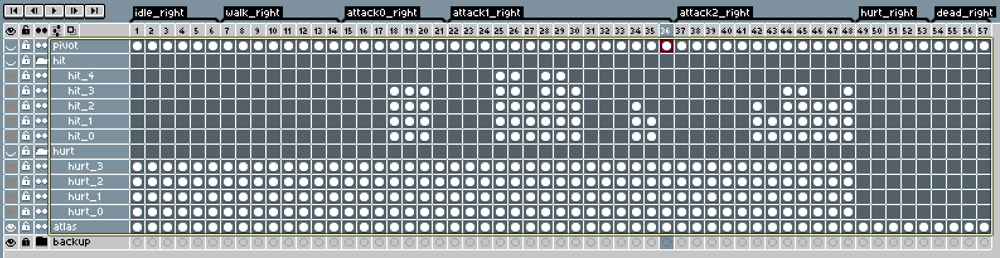
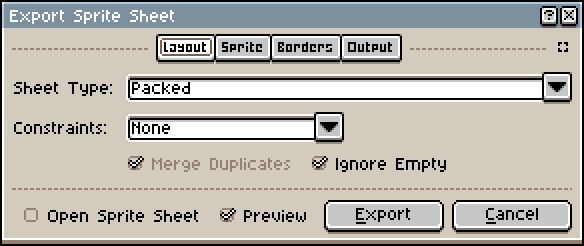
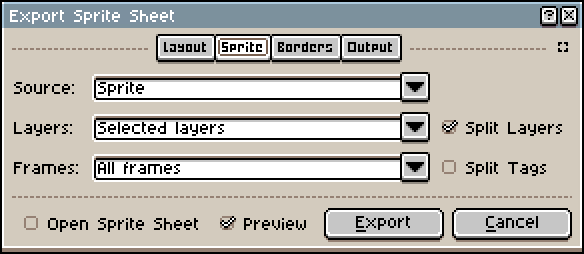
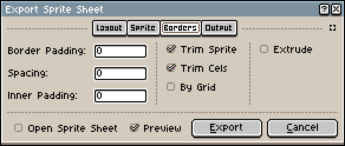
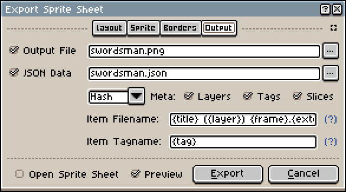

# Aseprite conversion

You can export atlases, animations, and collider data from **Aseprite** files. This section explains how to prepare your files so they can be correctly processed by the asset pipeline.

## Layers

Layers must follow **strict naming conventions** to be recognized:

* `pivot`
  Place the pivot manually per frame by drawing a shape. The final pivot is computed as the center of the AABB formed by that shape.
* `hit_*`
  Hitbox generation is supported for up to **5 hitboxes per frame** (`hit_0`, `hit_1`, ..., `hit_4`). Each hitbox is deduced from the AABB of the drawn shape.
* `hurt_*`
  Same principle as hitboxes, but for hurtboxes. Most hurtboxes are typically drawn around the feet (or equivalent), as the game uses a pseudo-depth, top-down 2D roguelike perspective.
* `atlas`
  Contains all visual data, collapsed into a single layer.

Any other layer will be ignored by the conversion pipeline. This is intentional and allows you to keep reference or helper layers in your Aseprite files.

Here is an example of how the layers should look in Aseprite:

**Note:** Remember to hide `pivot`, `hit_*`, and `hurt_*` layers before exporting, otherwise they will appear in the final sprites.

## Metadata

Extra metadata can be provided to describe information that is not natively supported by Aseprite.

If the exported texture is named `[NAME].png`, the corresponding metadata file must be named: `[NAME].meta.json`.

Currently, metadata is used to define:
* animation events,
* animation solving rules (for example, reusing a right-facing animation for left-facing directions when only one is authored).

Examples:
* [Animation events](https://github.com/m4jr0/rogue-like/blob/main/assets/aseprite/adventurer.meta.json)
* [Animation solving](https://github.com/m4jr0/rogue-like/blob/main/assets/aseprite/swordsman.meta.json)

## Exporting Aseprite data

Spritesheets **must be packed and trimmed**. Otherwise, pivots and hit/hurtboxes will not align correctly, as exported frames would be larger than the shapes used to define them.

When exporting:
* Export both the spritesheet image and the JSON data.
* Both files must share the same stem name.
* The optional `[NAME].meta.json` file must be created manually if metadata is needed (see **Metadata** above).

Below is an example of a valid exported spritesheet configuration:

When exporting, remember to explicitly select all relevant layers (`atlas`, `pivot`, etc.).

Finally, copy the exported files into [`assets/aseprite`](https://github.com/m4jr0/rogue-like/blob/main/assets/aseprite/).

The asset pipeline will automatically generate the corresponding engine resources in:

* [`assets/animcolprofile`](https://github.com/m4jr0/rogue-like/blob/main/assets/animcolprofile/)
* [`assets/animset`](https://github.com/m4jr0/rogue-like/blob/main/assets/animset/)
* [`assets/atlas`](https://github.com/m4jr0/rogue-like/blob/main/assets/atlas/)
* and other related output directories (the exact outputs may change as the pipeline evolves).
